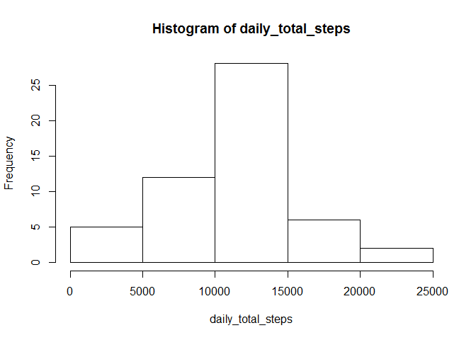
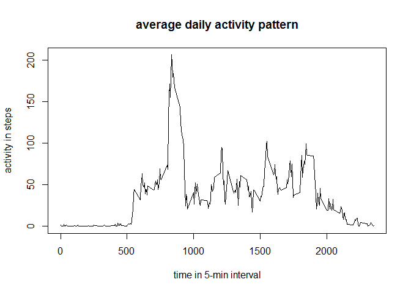
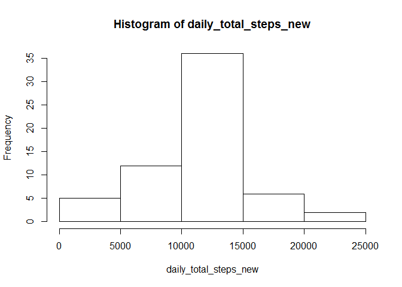
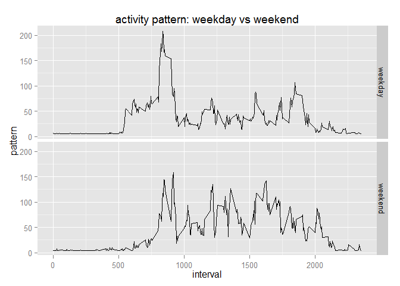

# Reproducible Research: Peer Assessment 1


## Loading and preprocessing the data


```r
if (!file.exists("activity.zip")) {
    download.file("https://d396qusza40orc.cloudfront.net/repdata%2Fdata%2Factivity.zip", 
                  "activity.zip", "curl", TRUE)
}

if (!file.exists("activity.csv")) {
    unzip("activity.zip")
}

activity <- read.csv("activity.csv") ## 61 days, 17568 obs

summary(activity)
```

```
##      steps                date          interval     
##  Min.   :  0.00   2012-10-01:  288   Min.   :   0.0  
##  1st Qu.:  0.00   2012-10-02:  288   1st Qu.: 588.8  
##  Median :  0.00   2012-10-03:  288   Median :1177.5  
##  Mean   : 37.38   2012-10-04:  288   Mean   :1177.5  
##  3rd Qu.: 12.00   2012-10-05:  288   3rd Qu.:1766.2  
##  Max.   :806.00   2012-10-06:  288   Max.   :2355.0  
##  NA's   :2304     (Other)   :15840
```

```r
sum(is.na(activity))    ## number of missing values NA's
```

```
## [1] 2304
```

```r
activity_na_rm <- activity[complete.cases(activity),] ## 53 days, 15264 obs.
```

### What is mean total number of steps taken per day?
There are 8 days with all NA's in the steps which are excluded. Remaining 53 days have an average of 10766 steps taken per day.


```r
daily_total_steps <- tapply(activity_na_rm$steps, activity_na_rm$date, sum)

## Plot histogram
## png(file = "PA1_plot1.png")
hist(daily_total_steps)
```

 

```r
##dev.off()

mean_total_steps <- mean(tapply(activity$steps, activity$date, sum), na.rm = TRUE)
paste("mean = ", mean_total_steps)
```

```
## [1] "mean =  10766.1886792453"
```

```r
median_total_steps <- median(tapply(activity$steps, activity$date, sum), na.rm = TRUE)
paste("median = ", median_total_steps)
```

```
## [1] "median =  10765"
```


### What is the average daily activity pattern?
The average daily activity picks up around 530 (wakeup time) with a shape spike around 835 and holds steady throughout the day until it finally decreases after 2000 (dinner time).


```r
daily_activity <- tapply(activity_na_rm$steps, activity_na_rm$interval, mean)

## Plot average daily activity
## png(file = "PA1_plot2.png")
plot(unique(activity$interval), daily_activity, type = "l", main = "average daily activity pattern", xlab = "time in 5-min interval", ylab = "activity in steps")
```

 

```r
## dev.off()

for (i in 1:length(daily_activity)) {
      if (daily_activity[i] == max(daily_activity)) most_active <- names(daily_activity)[i]
}

paste("most active at interval #", most_active)
```

```
## [1] "most active at interval # 835"
```


### Imputing missing values


Use mean instead of median for imputing as mean method does not skew the data.


```r
sum(is.na(activity))    ## number of missing values NA's
```

```
## [1] 2304
```

```r
steps <- replace(activity$steps, is.na(activity$steps), mean(activity$steps, na.rm=TRUE))

activity_new <- cbind(steps, select(activity, one_of(c("date", "interval"))))

daily_total_steps_new <- tapply(activity_new$steps, activity_new$date, sum)

## png(file = "PA1_plot3.png")
hist(daily_total_steps_new)
```

 

```r
## dev.off()

mean_total_steps_new <- mean(tapply(activity_new$steps, activity_new$date, sum), na.rm = TRUE)
paste("new_mean = ", mean_total_steps_new)
```

```
## [1] "new_mean =  10766.1886792453"
```

```r
median_total_steps_new <- median(tapply(activity_new$steps, activity_new$date, sum), na.rm = TRUE)
paste("new_median = ", median_total_steps_new)
```

```
## [1] "new_median =  10766.1886792453"
```


### Are there differences in activity patterns between weekdays and weekends?

As can be seen below, weekday activity spikes higher in the morning hours whereas weekend activity turns up a couple hours later than weekdays and distributes more evenly throughout the wake hours. 


Convert date to two-level factor: weekday 45 (12960) and weekend 16 (4608)


```r
weekend <- as.factor(ifelse(is.weekend(activity_new$date), "weekend", "weekday"))

activity_weekend <- cbind(activity_new, weekend)

pattern_weekend <- ddply(activity_weekend, 
                   .(weekend, interval), summarize, 
                   pattern = mean(steps))  

## Plot to compare weekday vs. weekend
## png(file = "PA1_plot4.png")
qplot(interval, pattern, data=pattern_weekend, facets = weekend ~., geom="line", main = "activity pattern: weekday vs weekend")
```

 

```r
##dev.off()
```
